# Fiestas Valladolid 2026

Repositorio independiente para publicar la agenda de Fiestas Valladolid 2026 dentro de Aldea Pucela Eventos.

La salida generada es una web estatica para `https://fiestas.aldeapucela.org/`, con listado interactivo, filtros, favoritos en navegador, mapa y paginas de detalle por evento.

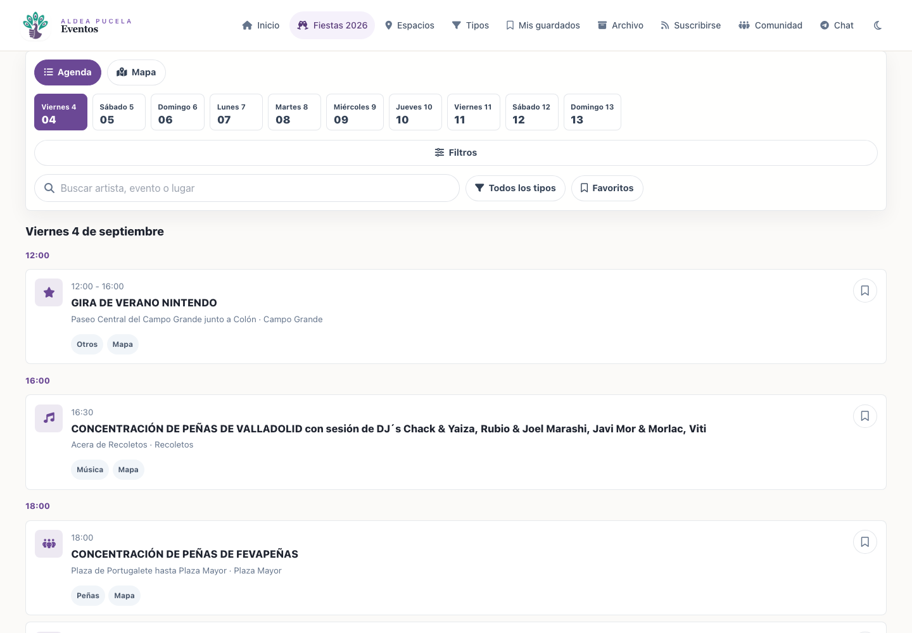

## Que Genera

El build crea el contenido en `dist/`. Esa carpeta es salida generada y no debe editarse a mano.

- `/`: agenda principal.
- `/e/<id>/`: detalle de cada evento.
- `/assets/css/fiestas-2026.css`: estilos compilados con Tailwind, PostCSS y Autoprefixer.
- `/assets/js/fiestas-2026.js`: comportamiento de agenda, mapa, filtros y favoritos.
- `/assets/js/menu-drawer.js`, `/assets/js/subscribe.js`, `/assets/js/theme.js`: modulos compartidos de UI.
- `/sitemap.xml` y `/robots.txt`: metadatos de rastreo.

## Estructura

```text
src/
  data/fiestas-2026/events.json     Datos fuente de los eventos
  scripts/                          Modulos ES para el navegador
  styles/                           CSS base y CSS especifico de fiestas
  templates/                        Layouts, paginas y parciales Nunjucks
scripts/
  build.mjs                         Generador estatico
  dev.mjs                           Build + servidor local
  enrich-event-locations.mjs        Auditoria y enriquecimiento manual de ubicaciones
  capture-readme-screenshots.mjs    Capturas para esta documentacion
dist/                               Salida generada
docs/screenshots/                   Capturas enlazadas en el README
```

## Requisitos

- Node.js 24 o compatible con ES modules.
- npm.
- Google Chrome, solo para regenerar capturas.
- `cloudflared`, solo si se quiere exponer el servidor local con Cloudflare Tunnel.

## Instalacion

```bash
npm install
```

## Desarrollo Local

```bash
npm run dev
```

El comando hace un build inicial y sirve `dist/` en:

```text
http://127.0.0.1:8002/
```

Durante el desarrollo, `npm run dev` observa `src/`, reconstruye la salida cuando cambia un archivo y sirve HTML, CSS y JavaScript con `Cache-Control: no-store`. Así los cambios se pueden comprobar inmediatamente en el navegador integrado.

Si necesitas otro puerto:

```bash
PORT=8010 npm run dev
```

## Build

```bash
npm run build
```

El build:

1. Limpia `dist/`.
2. Compila `src/styles/base.css` y `src/styles/fiestas-2026.css`.
3. Copia los modulos JS de `src/scripts/`.
4. Copia assets estaticos desde `src/assets/`, si existen.
5. Lee `src/data/fiestas-2026/events.json`.
6. Normaliza, ordena y enriquece cada evento con icono, URL local, URL canonica, texto de compartir, etiquetas de entrada y enlaces de mapa.
7. Conserva los metadatos de procedencia de `coordinates` cuando existen.
8. Renderiza la agenda y una pagina de detalle por evento con Nunjucks.
9. Escribe `sitemap.xml` y `robots.txt`.

Para limpiar solo la salida generada:

```bash
npm run clean
```

## Exponer Con Cloudflare

Con el servidor local activo:

```bash
cloudflared tunnel --url http://127.0.0.1:8002
```

Cloudflare devolvera una URL publica temporal de `trycloudflare.com`. La app queda disponible en la raiz del subdominio temporal, por ejemplo:

```text
https://<subdominio>.trycloudflare.com/
```

## Datos De Eventos

La fuente unica de eventos esta en:

```text
src/data/fiestas-2026/events.json
```

Cada evento debe tener un `id` lowercase y seguro para URL. Ese `id` se usa en la ruta:

```text
/e/<id>/
```

Campos principales:

- `id`: identificador estable y URL-safe.
- `date`, `dateLabel`, `startTime`, `endTime`: fecha y horarios.
- `title`, `summary`, `description`: textos visibles y metadatos.
- `location`, `zone`: ubicacion textual.
- `type`: categoria principal usada por el icono y como primera etiqueta.
- `tags`: etiquetas opcionales para eventos que encajan en mas de una categoria. Si no se indica, se usa `[type]`.
- `performances`, `organizers`, `collaborators`: listas opcionales para la ficha.
- `coordinates`: coordenadas para mapa. Como minimo `{ "lat": number, "lng": number }`.
- `ticket`: informacion opcional de entradas.
- `image`: imagen editorial opcional para la ficha. Si no existe, la ficha no pinta imagen superior.

Ejemplo minimo:

```json
{
  "id": "2026-09-04-1200-gira-de-verano-nintendo-8abd9b5d",
  "date": "2026-09-04",
  "dateLabel": "Viernes 4 de septiembre",
  "startTime": "12:00",
  "endTime": "16:00",
  "title": "GIRA DE VERANO NINTENDO",
  "location": "Paseo Central del Campo Grande junto a Colon",
  "zone": "Campo Grande",
  "type": "Otros",
  "tags": ["Otros"],
  "coordinates": {
    "lat": 41.6468,
    "lng": -4.7289,
    "source": "Manual/alias from OpenStreetMap geocoding"
  },
  "ticket": {
    "required": false,
    "status": "unknown",
    "label": "Entrada no indicada",
    "url": null,
    "note": "El programa no indica venta de entradas para este evento."
  }
}
```

### Coordenadas

Cuando exista ubicacion geografica, `coordinates` puede conservar metadatos para poder revisar su procedencia:

```json
{
  "lat": 41.6468,
  "lng": -4.7289,
  "source": "OpenStreetMap Nominatim",
  "osmType": "way",
  "osmId": 123456,
  "query": "Campo Grande, Valladolid, Espana",
  "accuracy": 0.92,
  "geocodedAt": "2026-08-21T10:00:00.000Z"
}
```

El build mantiene esos metadatos en el objeto derivado del evento. Si `lat` o `lng` no son numeros validos, el evento se trata como sin mapa.

### Entradas

La ficha muestra siempre un estado normalizado de entrada:

- `Gratis`: `ticket.required` es falso o no hay entrada obligatoria.
- `De pago`: `ticket.required` es verdadero y no se detecta un flujo de inscripcion.
- `Inscripcion`: `ticket.required` es verdadero y la informacion apunta a un registro, por ejemplo `espaciosjovenesvalladolid`.

Si `ticket.url` existe, el estado de entrada se muestra como enlace en la tarjeta principal con icono de enlace externo. No se renderiza una tarjeta separada de entradas.

## Agenda

La pantalla principal agrupa los eventos por dia y hora. Al cargar, el script selecciona el evento actual si coincide con la fecha/hora del navegador; si no, salta al siguiente evento futuro y mantiene activo el chip de fecha correspondiente.


## Busqueda

El buscador filtra en cliente por texto normalizado. Busca en titulo, lugar, zona, tipo, descripcion, resumen, entradas, actuaciones, organizadores, colaboradores y etiqueta de fecha.

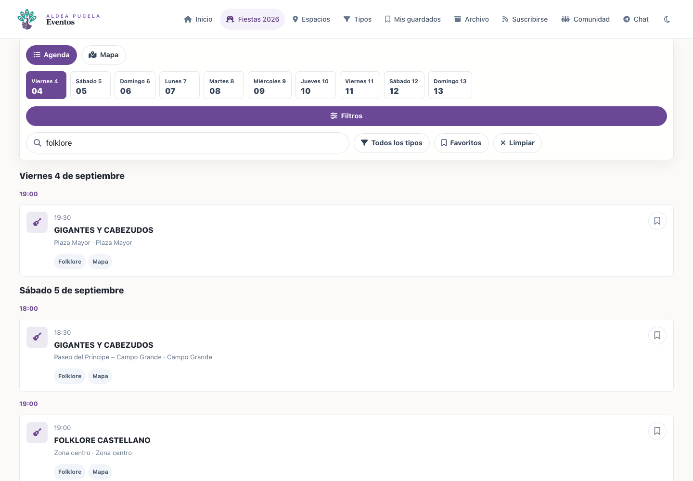

## Filtros Por Tipo

El menu de tipos se genera a partir de `tags` y, si no existen, de `type`. Permite combinar varios tipos y actualiza la etiqueta del boton con el tipo elegido o con el numero de tipos activos.

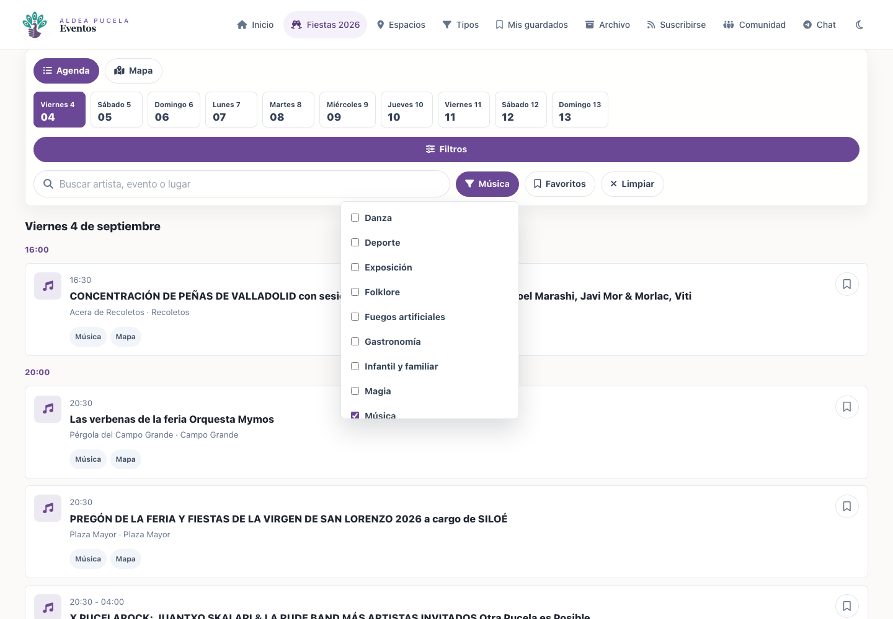

## Favoritos

Cada tarjeta tiene un boton de guardado. Los favoritos se almacenan en `localStorage` con la clave `fiestasPucela:favorites`, por lo que son locales al navegador del usuario. El boton `Favoritos` limita la agenda a los eventos guardados.

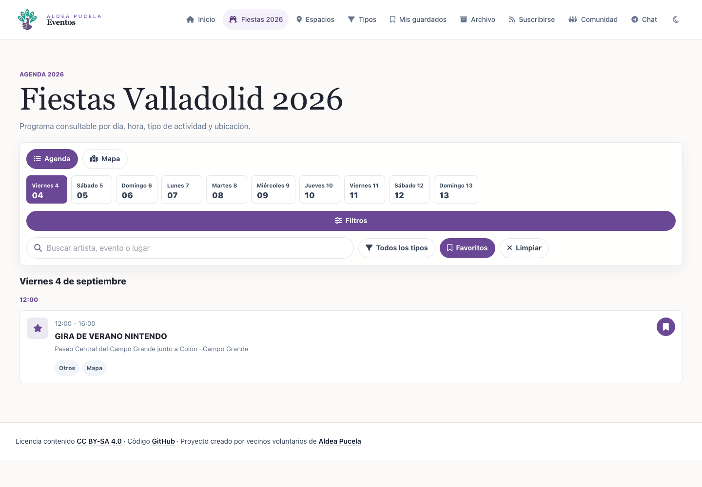

## Mapa

La vista `Mapa` carga Leaflet bajo demanda y solo pinta eventos con `coordinates`. Los marcadores se ajustan a los eventos filtrados y el popup enlaza con la ficha del evento.

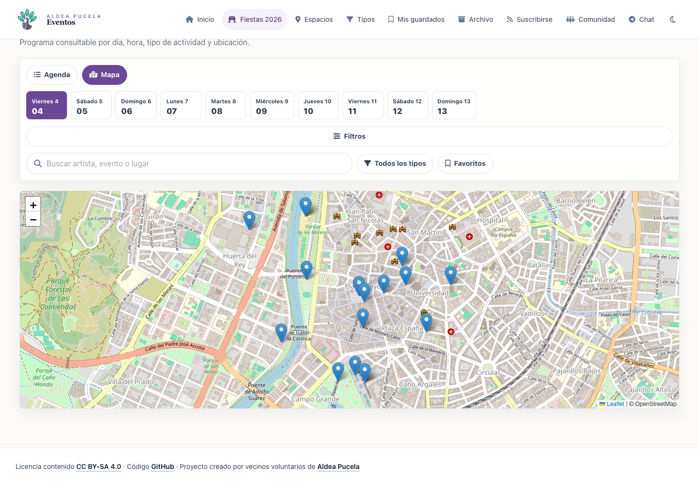

## Detalle De Evento

Cada evento genera una ficha estatica en `/e/<id>/` con una composicion mobile-first:

- Cabecera con volver, guardar y compartir.
- Titulo completo de la actividad.
- Todos los `tags` del evento como chips.
- Tarjeta principal con fecha, hora, lugar, zona/barrio y estado de entrada.
- Mapa compacto si hay coordenadas validas.
- Estado textual si faltan coordenadas.
- Descripcion, actuaciones, organizadores y colaboradores cuando existen.
- Navegacion inferior coherente con la agenda.

La imagen superior es opcional. Solo se pinta si el evento trae `image`; no hay fallback visual automatico para eventos sin imagen.

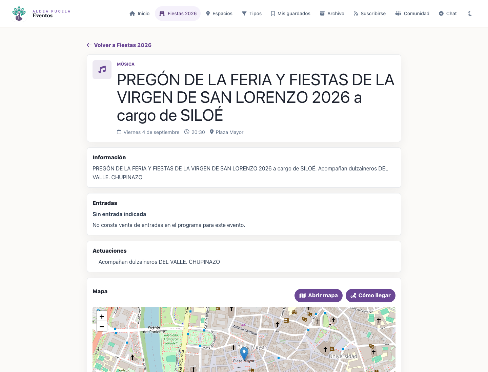

### Guardar

El boton de guardar de la ficha reutiliza el mismo almacenamiento local que la agenda:

```text
localStorage["fiestasPucela:favorites"]
```

El guardado se hace por `id` estable, actualiza `aria-pressed`, cambia el icono y muestra feedback inmediato. El estado se mantiene tras recargar.

### Compartir

El boton de compartir sigue esta prioridad:

1. Usa Web Share API si `navigator.share` esta disponible.
2. Si no esta disponible, copia la URL canonica con `navigator.clipboard.writeText`.
3. Si tampoco hay portapapeles, muestra un campo con la URL para copiar manualmente.

El texto de compartir se deriva en build con titulo, fecha, hora y lugar cuando existen. La URL compartida apunta siempre a la ruta canonica:

```text
https://fiestas.aldeapucela.org/e/<id>/
```

### Mapa De La Ficha

Si el evento tiene coordenadas validas, la ficha inicializa Leaflet con un unico marcador centrado en la actividad. La atribucion de OpenStreetMap/CARTO permanece visible, y los controles de Leaflet quedan por debajo de la navegacion inferior.

Las acciones del mapa son:

- `Ver en el mapa`: abre la agenda en modo mapa con `/?view=map&event=<id>`.
- `Como llegar`: abre Google Maps con destino en las coordenadas.

Ejemplo de ficha con mapa y entrada gratis:

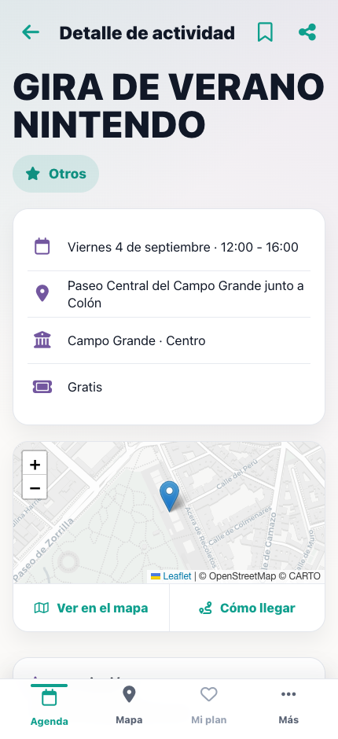

Ejemplo de ficha con varios tags y entrada de pago:

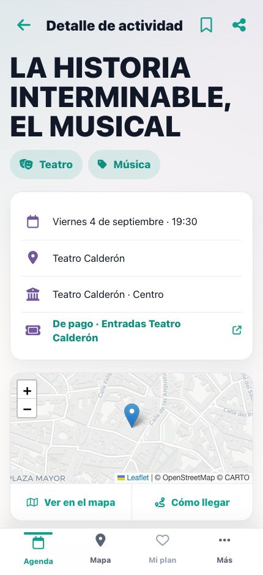

Si faltan coordenadas, no se monta Leaflet y se muestra el estado `Ubicacion en mapa no disponible` sin romper la ficha.

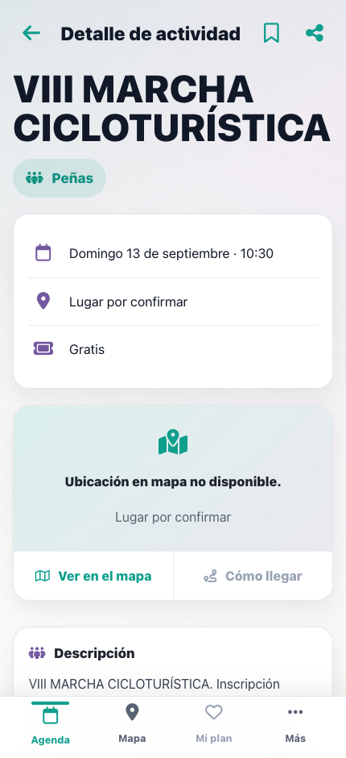

### Volver Desde La Ficha

El boton de volver usa `history.back()` cuando el `referrer` pertenece al mismo origen y hay historial disponible. Si se accede directamente a la ficha, el fallback lleva a `/`.

## Movil

En pantallas pequenas, la navegacion principal pasa a un drawer lateral. Los filtros se pliegan detras del boton `Filtros` para mantener visible la agenda.

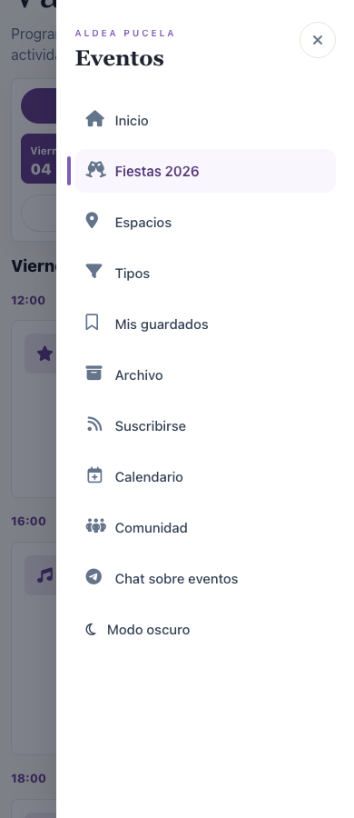

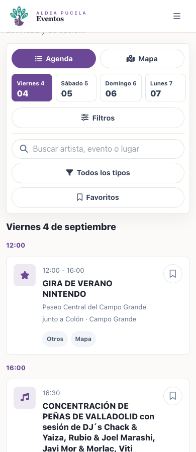

## Tema

El tema claro/oscuro se controla desde `src/scripts/theme.js` y se guarda en `localStorage` con la clave `aldeapucela_theme`. El layout aplica el tema pronto para evitar parpadeos al cargar.

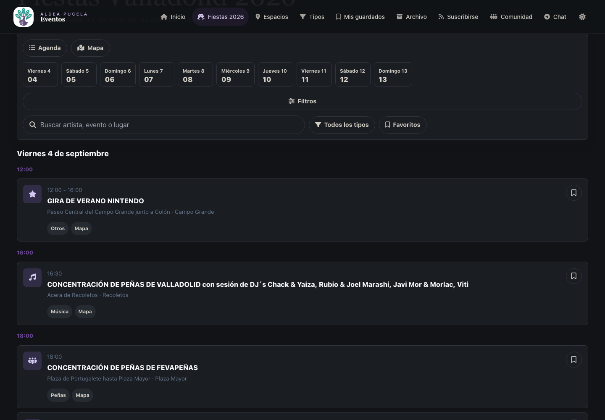

## Auditoria Y Enriquecimiento De Ubicaciones

El repositorio incluye un script manual para revisar eventos sin lugar, zona o coordenadas:

```bash
npm run locations:audit
```

Ese comando ejecuta:

```bash
node scripts/enrich-event-locations.mjs --dry-run
```

Por defecto solo audita localmente y no hace peticiones externas. Genera un informe JSON en:

```text
.cache/fiestas/reports/
```

La cache local de geocodificacion, cuando se usa un proveedor externo, vive en:

```text
.cache/fiestas/nominatim-location-cache.json
```

`.cache/` esta ignorado por Git.

### Modos Del Script

Auditoria local sin red:

```bash
node scripts/enrich-event-locations.mjs --dry-run
```

Consultar Nominatim sin modificar `events.json`:

```bash
node scripts/enrich-event-locations.mjs --dry-run --provider=nominatim
```

Aplicar resultados de confianza suficiente:

```bash
node scripts/enrich-event-locations.mjs --apply --provider=nominatim
```

Reparar tambien eventos que ya tienen coordenadas:

```bash
node scripts/enrich-event-locations.mjs --dry-run --provider=nominatim --repair
```

El script:

- Normaliza consultas con lugar/zona y `Valladolid, Espana`.
- No vuelve a geocodificar eventos con coordenadas validas salvo `--repair`.
- Usa cache local por consulta normalizada.
- Ejecuta una cola secuencial.
- Respeta una espera de 1100 ms entre consultas a Nominatim.
- Usa `User-Agent: AldeaPucelaFiestas/1.0 (contacto@aldeapucela.org)`.
- Separa resultados modificables, ambiguos y sin coincidencia.
- No aplica automaticamente resultados ambiguos o de baja confianza.
- Mantiene el proveedor encapsulado para poder sustituirlo.

## Capturas

Las capturas del README se regeneran con:

```bash
npm run screenshots
```

Antes de ejecutarlo, levanta la app:

```bash
npm run dev
```

Por defecto el script captura `http://127.0.0.1:8002`. Puedes cambiar la base:

```bash
FIESTAS_BASE_URL=http://127.0.0.1:8010 npm run screenshots
```

Si Chrome esta en otra ruta:

```bash
CHROME_PATH="/ruta/a/Google Chrome" npm run screenshots
```

### Capturas De Fichas Para PR

Las capturas especificas de la issue 2 estan en:

```text
docs/screenshots/issue-2/
```

Se pueden regenerar con Playwright usando Chrome del sistema, sin instalar Playwright como dependencia del proyecto:

```bash
npx -y playwright@latest screenshot --channel=chrome --viewport-size=430,940 --wait-for-timeout=3000 \
  http://127.0.0.1:8002/e/2026-09-04-1200-gira-de-verano-nintendo-8abd9b5d/ \
  docs/screenshots/issue-2/event-detail-mobile-map.png

npx -y playwright@latest screenshot --channel=chrome --viewport-size=430,940 --wait-for-timeout=3000 \
  http://127.0.0.1:8002/e/2026-09-04-1930-la-historia-interminable-el-musical-ce1048da/ \
  docs/screenshots/issue-2/event-detail-mobile-paid-tags.png

npx -y playwright@latest screenshot --channel=chrome --viewport-size=430,940 --wait-for-timeout=3000 \
  http://127.0.0.1:8002/e/2026-09-13-1030-viii-marcha-cicloturistica-cdb38072/ \
  docs/screenshots/issue-2/event-detail-mobile-no-coordinates.png
```

## Politica De URLs

Las rutas de Fiestas 2026 se publican en la raiz de `https://fiestas.aldeapucela.org/`. Los enlaces al resto de Aldea Pucela Eventos deben ser absolutos con base:

```text
https://eventos.aldeapucela.org/
```

## Verificacion Manual

Antes de publicar:

1. Ejecuta `npm run build`.
2. Revisa la agenda principal.
3. Prueba busqueda, filtro por tipo, favoritos y limpiar filtros.
4. Cambia entre agenda y mapa.
5. Abre una ficha de evento con coordenadas.
6. Abre una ficha de evento sin coordenadas y comprueba el estado textual.
7. Prueba guardar y compartir desde una ficha.
8. Revisa el drawer y los filtros en movil.
9. Cambia entre tema claro y oscuro.

## Politica De Cache De CSS Y JavaScript

El build genera versiones de contenido para los recursos propios:

- `cssVersion` es un hash corto del CSS compilado.
- `jsVersion` es un hash corto de los modulos JavaScript copiados a `dist/`.
- Las plantillas publican esos valores como `?v=<version>` en cada referencia local.

Por tanto, cualquier cambio efectivo en CSS cambia la URL del CSS y cualquier cambio efectivo en JavaScript cambia la URL del modulo. El navegador puede mantener una version anterior, pero nunca la confundira con la nueva. No hay que editar manualmente nombres de archivos ni incrementar un numero a mano: basta con ejecutar `npm run build` (o usar `npm run dev`).
